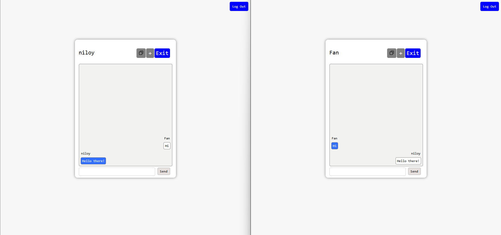

# Instant Messenger

Une messagerie instantanée qui permet des conversations privées et des chats en groupe, avec gestion des utilisateurs et des notifications.

## Description

Ce projet, réalisé dans le cadre d'un projet NSI, est une application de messagerie instantanée développée en utilisant PHP, HTML, JavaScript, JQuery, AJAX et CSS. Elle permet des conversations privées et des chats en groupe, avec une gestion des utilisateurs et des notifications en temps réel. 

## Demo

## Prérequis

- Serveur web (Apache, Nginx, etc.)
- PHP
- Navigateur web
